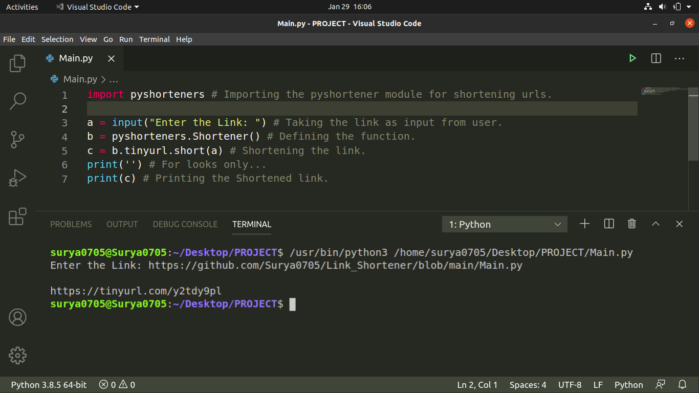

# Link_Shortener
This is a Python Program that shortens the URL which it takes as input. It uses a module named pyshortener. You can install it by:
```
pip install pyshorteners
```
Or if you are in Linux(Ubuntu 20.04 LTS which I am using) then use:
```
pip3 install pyshorteners
```
Or install according to your OS. After installation just run the Main.py file and type the link in your terminal. Doing this will display the shortened URL of that particular link. Below is my Code Screenshot:


Hope that you liked it.
